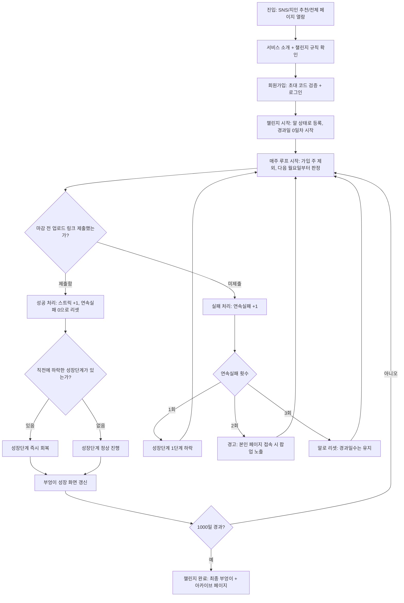

> **v1.2 supersession note:** This file preserves the original v1.0 planning history. Any egg-stage, stage-drop/reset, 1000-day-first-goal, or old admin-flow guidance is superseded by `spec/10-v1.1-operations-addendum.md`, `spec/11-v1.2-product-growth-plan.md`, and `context-notes.md`.

# 사용자 여정과 핵심 흐름

## 핵심 흐름 (Mermaid)

## Happy Path
진입 → 초대 코드로 회원가입 → 챌린지 시작(알) → 매주 업로드 링크 제출(자동 검증) → 스트릭 증가 및 성장 → 1000일 경과 → 완료 화면

## 실패 경로
매주 마감(일요일 23:59) 전 미제출 시 연속실패가 누적된다. 1회는 성장단계 하락, 2회는 경고(대시보드 진입 시 팝업), 3회째에 알로 리셋되지만 1000일 경과 카운트는 유지된다. 이후 어느 시점이든 1회 성공하면 직전 하락분은 즉시 회복된다.

## 업로드 인증 경로
링크 제출 → 자동 검증 시도 → 성공 시 "검증됨" 표시 → 실패/불가 시 제출은 그대로 인정하고 "미검증" 배지 + 재시도 버튼 제공.

## 결정 / 근거 / 가정

- **결정**: 연속실패 기준 카운트, 하락분은 다음 1회 성공 시 즉시 회복
- **결정**: 알 리셋 시 1000일 경과 카운트는 유지 (성장 단계만 리셋)
  **근거**: 장기 이탈 방지, 기존 경과일의 서사 보존
- **결정**: 경고 알림은 본인 페이지 접속 시 팝업으로 노출 (푸시/이메일은 Should로 보류)
- **결정**: 마감은 매주 일요일 23:59, 판정 주차는 월요일~일요일
- **결정**: 경과일은 가입/온보딩 즉시 0일차 시작, 주간 판정은 가입 주를 제외하고 다음 월요일부터 시작
- **위험**: 경고 단계에서 사용자가 이탈할 가능성 (완화책: 완전 리셋 아닌 단계적 페널티로 설계됨)
